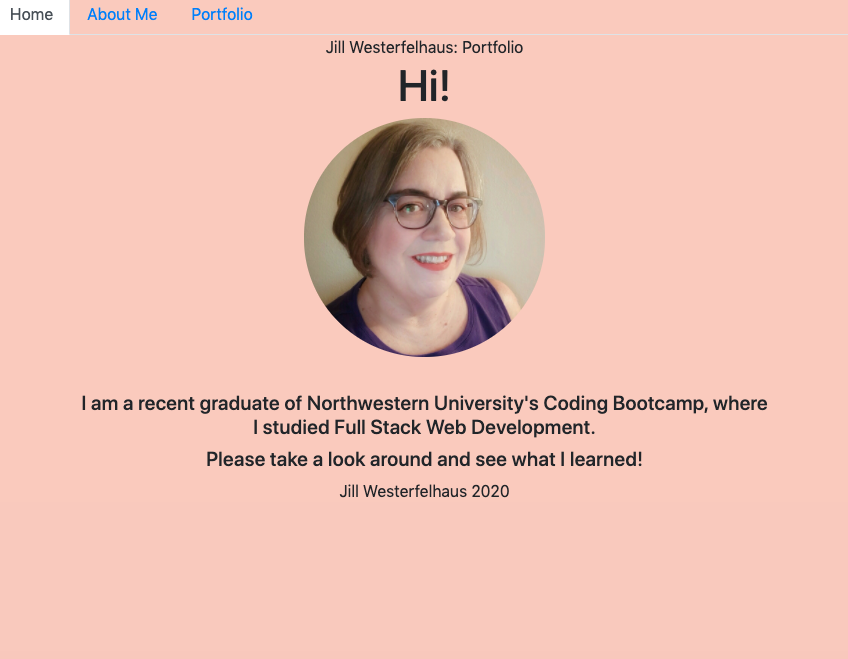

# ReactPortfolio

This is an assignment for Northwestern University Coding Bootcamp. It consists of a revised and updated portfolio done with Reactjs.

## Motivation
The purpose of this project is to update professional materials, show recent work, create an app with React, and build towards becoming employer competitive.

## Build Status
This project is complete.

## Tech Used
This project was built with React, CSS and Bootstrap. 

## License
This project is in the public domain per https://unlicense.org/.  

## URL of deployed portfolio

https://sleepy-fjord-66000.herokuapp.com/

## Credits

Thanks to Nick Elliot, my instructor; and Chris McLaughlin, TA, for helping me with the code.  I also want to thank Alex Bailon and Jee Zhou for helping me create clickable links on the portfolio page. 

Thanks to Alex Bailon, Bikram Shankhar, Zaki Khan and Kyle Resurreccion for the amazing job they did coding the Flyte! app.

Thanks to Jules Lazar and Mohmed Vaid for the awesome work they did on the My Pantry app.

Thanks to Tressa Park and Bikram Shankhar for their work on the Flix app.

I would especially like to thank my tutor, Daniel Masters, for his patience and persistence while working with me during the coding bootcamp. 
